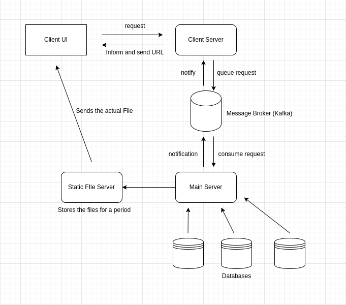

# Data Export System with Kafka, NGINX, and Streamlit

This project implements a distributed data export system where users can request data exports from a Streamlit UI (prototype). The request is passed through a Kafka-based messaging pipeline to a backend processing server, and the resulting exported files are delivered back to the user via a static file server (NGINX) in Docker.

## System Overview



### Flow Description

1. **User Request via UI (Streamlit)**  
   The user fills out a form specifying:
   - The target database
   - The data range (start & end date)
   - The export file format (e.g., JSON or CSV)

2. **Client Server (Spring Boot)**  
   - Receives the request
   - Sends the data as a `Kafka message` to the **Main Server**

3. **Main Server (Spring Boot)**  
   - Listens for incoming Kafka messages
   - Gathers data from one or more PostgreSQL databases
   - Exports the data into a file (CSV or JSON)
   - Saves the file into an NGINX container acting as a static file server
   - Sends a **Kafka response message** back to the **Client Server** including:
     - File download URL
     - Export ID
     - Status message

4. **Client Server (Kafka Consumer)**  
   - Listens for Kafka responses
   - Updates a shared endpoint where the **Streamlit UI** can pull available downloads
   - Marks a file as "Downloaded" when the user clicks the download button

5. **Static File Server (NGINX + Docker)**  
   - Hosts the exported files under a public download path
   - Automatically deletes expired files after a defined TTL (Time To Live)

## Tech Stack

| Component         | Tech Used             |
|------------------|-----------------------|
| Client UI        | [Streamlit](https://streamlit.io) |
| Client Server    | Java + Spring Boot    |
| Message Broker   | [Apache Kafka](https://kafka.apache.org) |
| Main Server      | Java + Spring Boot    |
| Static File Host | [NGINX](https://nginx.org) inside [Docker](https://www.docker.com/) |
| Databases        | PostgreSQL            |

## Features

- Asynchronous communication via Kafka
- On-demand export to JSON or CSV
- File delivery through NGINX static hosting
- Files automatically expire after a period
- Responsive UI with Streamlit (download on-demand)
- Stateless message-based communication between client and main servers

## File Download Behavior

- Download status is tracked by the **Client Server**
- When the user clicks "Download":
  - The Streamlit UI sends a request
  - The file is fetched from NGINX
  - The **Client Server** marks it as **Downloaded**
  - The file is **removed from the UI list**
  - NGINX handles eventual cleanup (e.g., via `cron` or `tmpwatch`)

## Modules

### `client-ui/`
- Streamlit UI code

### `client-server/`
- Spring Boot app with Kafka consumer
- REST endpoints to expose available files

### `main-server/`
- Spring Boot Kafka producer and consumer
- Data export engine connected to PostgreSQL

### `nginx-static/`
- Dockerized NGINX serving `/exported-files`
- Periodic cleanup of old files

## Setup

1. Start Kafka broker (e.g. using Docker or local install)
2. Run NGINX container:
   ```bash
   docker run -d -p 8090:80 \
     -v $(pwd)/exported-files:/usr/share/nginx/html/exported-files \
     --name static-file-server nginx
   ```
3. Run Docker Files for Kafka and Postgres
4. Run `client-server` and `main-server` Spring Boot apps
5. Launch the Streamlit UI:
   ```bash
   streamlit run main.py
   ```

## TODO / Future Improvements

- Add authentication to secure file access
- File encryption support
- More export formats (Excel, Parquet)
- User-specific file directories
- Admin dashboard for tracking/export history

## Inspiration

Designed for real-world file delivery systems with modern microservices and decoupled messaging in mind. Ideal for reporting, analytics, or archival systems.
